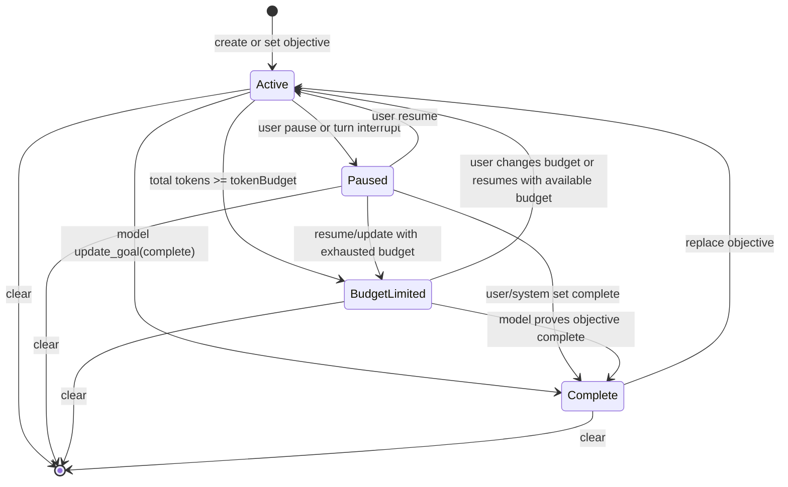

# DotCraft Goal Design Specification

| Field | Value |
|-------|-------|
| **Version** | 0.2.0 |
| **Status** | Living |
| **Date** | 2026-05-08 |
| **Parent Specs** | [Session Core](session-core.md), [AppServer Protocol](appserver-protocol.md) |

Purpose: Define DotCraft's server-managed persistent thread goal feature, including the Session Core domain model, runtime lifecycle, persistence contract, model tool surface, AppServer wire projection, and client UX expectations.

## Table of Contents

- [1. Scope](#1-scope)
- [2. Design Intent](#2-design-intent)
- [3. System Architecture](#3-system-architecture)
- [4. Domain Model](#4-domain-model)
- [5. State Machine](#5-state-machine)
- [6. Persistence](#6-persistence)
- [7. Session Core Contract](#7-session-core-contract)
- [8. Runtime Lifecycle](#8-runtime-lifecycle)
- [9. Model Tool Surface](#9-model-tool-surface)
- [10. AppServer Protocol Projection](#10-appserver-protocol-projection)
- [11. Client UX Contract](#11-client-ux-contract)
- [12. Automations and Long-Running Work](#12-automations-and-long-running-work)
- [13. Concurrency and Ordering](#13-concurrency-and-ordering)
- [14. Failure Model](#14-failure-model)
- [15. Security and Prompt Safety](#15-security-and-prompt-safety)
- [16. Configuration and Capability Gating](#16-configuration-and-capability-gating)
- [17. Acceptance](#17-acceptance)

---

## 1. Scope

### 1.1 What This Spec Defines

This specification defines a persistent goal attached to a server-managed Session Core thread.

A goal is a user-declared long-running objective that DotCraft can continue over time. It is persisted, resumed with the thread, tracked for token and elapsed-time usage, and advanced by Session Core when the thread is idle.

This spec covers:

- the `ThreadGoal` domain model
- status transitions and lifecycle rules
- persistence in `.craft/state.db`
- Session Core APIs and events
- goal-aware runtime accounting
- automatic continuation turns
- model-visible goal tools
- AppServer JSON-RPC methods and notifications
- client UX expectations for CLI, TUI, Desktop, ACP, and external channels

### 1.2 Relationship to Existing Specs

| Spec | Relationship |
|------|--------------|
| `session-core.md` | Owns Thread / Turn / Item lifecycle. Goal state is an extension of the Thread domain model and is executed by Session Core. |
| `appserver-protocol.md` | Projects Session Core goal APIs to out-of-process clients through JSON-RPC. |
| `automations-lifecycle.md` | Automations may bind to or resume goal-backed threads, but goal state remains owned by Session Core. |
| `tui-client.md` / `desktop-client.md` | Client UX may expose goal controls, but this spec defines behavior rather than visual layout. |

### 1.3 In Scope Channels

Goals apply only to server-managed channels that execute through `ISessionService`:

- CLI
- TUI
- ACP
- Desktop through AppServer
- QQ
- WeCom
- external channel adapters that submit server-managed turns
- Automations when they submit to server-managed threads

API and AG-UI remain client-managed channels and are not required to implement goal persistence or continuation through this spec.

### 1.4 Non-Goals

- This spec does not make arbitrary user prompts into goals. Goal creation is explicit.
- This spec does not introduce multi-goal queues. A thread has at most one current goal.
- This spec does not redefine model orchestration or replace `Microsoft.Extensions.AI`.
- This spec does not require automatic background execution while no DotCraft process is running.
- This spec does not allow the model to pause, resume, abandon, or budget-limit a goal by itself.
- This spec does not require API or AG-UI to migrate to Session Core.

---

## 2. Design Intent

Design intent:

1. **Thread-owned durable state**: The current goal belongs to a Session Core thread, not to a UI client or channel adapter.
2. **Single authoritative state machine**: Session Core owns status transitions, accounting, continuation, and model steering.
3. **Thin clients**: Clients can set, clear, pause, resume, and display goals, but they do not own the goal runtime.
4. **Protocol symmetry**: AppServer exposes goal methods using the same JSON-RPC shape and notification style as existing thread methods.
5. **Safe autonomy**: An active goal may continue automatically only when the thread is idle and no user or system work is pending.
6. **Model-limited control**: The model can read goals, explicitly create goals when requested, and mark a goal complete after an audit. It cannot suppress or alter the user's control over goal execution.
7. **Budget-aware stopping**: Token budget exhaustion is system-owned. It produces `budgetLimited`, steering, and UI feedback, not silent continuation.

---

## 3. System Architecture

### 3.1 Layering

```text
Client UX
  CLI / TUI / Desktop / ACP / Bot adapters
      |
      | goal commands, buttons, AppServer JSON-RPC
      v
AppServer Protocol Projection
  thread/goal/get
  thread/goal/set
  thread/goal/clear
  thread/goal/updated
  thread/goal/cleared
      |
      v
Session Core
  ThreadGoal domain model
  goal lifecycle service
  goal runtime accounting
  automatic continuation
  model goal tools
      |
      v
Persistence
  .craft/state.db thread_goals table
  thread JSONL history for goal-originated turns and system notices
```

### 3.2 Ownership Boundaries

| Component | Owns |
|-----------|------|
| Session Core | Goal model, state transitions, accounting, continuation, model tools, events, persistence calls. |
| AppServer | Wire DTOs, JSON-RPC routing, subscription/broadcast delivery, capability advertisement. |
| Client adapters | Command parsing, menu/buttons, local presentation, user confirmations. |
| Persistence layer | Atomic goal storage and usage updates in `.craft/state.db`. |
| AgentFactory/tool pipeline | Injection of goal tools when enabled and supported by the thread. |

Adapters must not implement independent goal state machines. A channel may expose `/goal`, but the command must translate to Session Core or AppServer goal operations.

### 3.3 Feature Positioning

Goals are a Session Core capability with optional UX surfaces. A host can expose the capability only when all of these are true:

- Session Core is available.
- The thread is persisted in `.craft/state.db`.
- Goal feature configuration is enabled.
- The effective agent tool pipeline can inject the goal tools, or the host intentionally exposes only user-controlled goal APIs.

---

## 4. Domain Model

### 4.1 ThreadGoal

`ThreadGoal` is the current persisted goal for a `SessionThread`.

```csharp
public sealed record ThreadGoal
{
    public required string ThreadId { get; init; }
    public required string GoalId { get; init; }
    public required string Objective { get; init; }
    public required ThreadGoalStatus Status { get; init; }
    public long? TokenBudget { get; init; }
    public required TokenUsage TokensUsed { get; init; }
    public required long TimeUsedSeconds { get; init; }
    public required DateTimeOffset CreatedAt { get; init; }
    public required DateTimeOffset UpdatedAt { get; init; }
}
```

Field semantics:

| Field | Semantics |
|-------|-----------|
| `ThreadId` | Owning Session Core thread id. |
| `GoalId` | Stable identity for the current logical goal. Replaced when objective replacement resets usage. |
| `Objective` | User-declared goal objective. It is user data, not higher-priority instructions. |
| `Status` | Current lifecycle state. |
| `TokenBudget` | Optional positive total-token budget. `null` means unbounded. |
| `TokensUsed` | Cumulative billing token usage attributed to this goal. |
| `TimeUsedSeconds` | Cumulative elapsed wall-clock seconds attributed to this goal. |
| `CreatedAt` | UTC timestamp when this logical goal was created. |
| `UpdatedAt` | UTC timestamp for the latest mutation or accounting update. |

`TokensUsed` uses DotCraft's existing `TokenUsage` shape, not a single integer. This preserves input/output/cache/reasoning breakdowns while still allowing a `TotalTokens` budget check.

Budget checks use `TokensUsed.TotalTokens`.

### 4.2 ThreadGoalStatus

```csharp
public enum ThreadGoalStatus
{
    Active,
    Paused,
    BudgetLimited,
    Complete
}
```

Wire values are lower camel case:

| Domain | Wire |
|--------|------|
| `Active` | `"active"` |
| `Paused` | `"paused"` |
| `BudgetLimited` | `"budgetLimited"` |
| `Complete` | `"complete"` |

Status semantics:

- `Active`: Session Core may continue this goal when the thread is idle.
- `Paused`: The goal is preserved but will not continue automatically.
- `BudgetLimited`: The goal reached or exceeded its token budget. DotCraft should not begin new substantive goal work until the user changes the goal or budget.
- `Complete`: The objective has been achieved. This is terminal for the current logical goal.

### 4.3 ThreadGoalUpdate

Goal mutations are patch-like:

```csharp
public sealed record ThreadGoalUpdate
{
    public string? Objective { get; init; }
    public Optional<ThreadGoalStatus> Status { get; init; }
    public Optional<long?> TokenBudget { get; init; }
}
```

`TokenBudget` has three states:

- omitted: leave unchanged
- `null`: clear budget
- positive integer: replace budget

`Objective` is always trimmed before validation. Empty objectives are invalid.

### 4.4 Validation

| Rule | Error |
|------|-------|
| `Objective` is empty after trim | Invalid request / invalid operation. |
| `Objective` exceeds 4000 Unicode scalar characters | Invalid request / invalid operation. |
| `TokenBudget <= 0` when provided | Invalid request / invalid operation. |
| Thread does not exist | Thread not found. |
| Thread is ephemeral or not persisted in state DB | Goals unsupported for this thread. |
| Mutating status or budget without an existing goal | Goal not found. |

Clients should enforce the objective length limit before sending, but Session Core remains authoritative.

---

## 5. State Machine

### 5.1 State Diagram



### 5.2 Replacement Rules

`SetThreadGoal` with an objective follows these rules:

1. If no goal exists, create a new active goal by default.
2. If a goal exists with the same objective and status is not `Complete`, update the existing goal and preserve usage.
3. If a goal exists with a different objective, replace it with a new `GoalId` and reset usage.
4. If a goal exists with the same objective and status is `Complete`, replace it with a new `GoalId` and reset usage.

### 5.3 Status Protection

Session Core and persistence must protect system-owned terminal states:

- A `BudgetLimited` goal must not be downgraded to `Paused` by a pause request.
- A `Complete` goal must not become `Active` unless the operation is an explicit replacement or an explicit admin/system mutation that resets the logical goal.
- If a goal is set to `Active` while `TokenBudget` is present and `TokensUsed.TotalTokens >= TokenBudget`, the stored status becomes `BudgetLimited`.

### 5.4 Clear

Clearing deletes the current goal row. It does not delete turns, usage events, or prior history.

Clients must treat `clear` as idempotent:

- first clear returns `cleared: true`
- later clears return `cleared: false`

---

## 6. Persistence

### 6.1 SQLite Table

Goals are stored in `.craft/state.db`.

```sql
CREATE TABLE thread_goals (
    thread_id TEXT PRIMARY KEY NOT NULL REFERENCES threads(id) ON DELETE CASCADE,
    goal_id TEXT NOT NULL,
    objective TEXT NOT NULL,
    status TEXT NOT NULL CHECK(status IN ('active', 'paused', 'budget_limited', 'complete')),
    token_budget INTEGER,

    input_tokens INTEGER NOT NULL DEFAULT 0,
    output_tokens INTEGER NOT NULL DEFAULT 0,
    cached_input_tokens INTEGER NOT NULL DEFAULT 0,
    cache_write_input_tokens INTEGER NOT NULL DEFAULT 0,
    reasoning_output_tokens INTEGER NOT NULL DEFAULT 0,
    total_tokens INTEGER NOT NULL DEFAULT 0,

    time_used_seconds INTEGER NOT NULL DEFAULT 0,
    created_at_utc TEXT NOT NULL,
    updated_at_utc TEXT NOT NULL
);
```

Notes:

- `thread_id` is the primary key to enforce one current goal per thread.
- `goal_id` is a logical concurrency guard used by accounting and continuation paths.
- `total_tokens` is persisted for atomic budget checks and must equal the sum of the stored token fields.

### 6.2 Persistence API

The persistence layer must provide atomic operations equivalent to:

- `GetThreadGoalAsync(threadId)`
- `ReplaceThreadGoalAsync(threadId, objective, status, tokenBudget)`
- `InsertThreadGoalAsync(threadId, objective, status, tokenBudget)`
- `UpdateThreadGoalAsync(threadId, update, expectedGoalId?)`
- `PauseActiveThreadGoalAsync(threadId)`
- `DeleteThreadGoalAsync(threadId)`
- `AccountThreadGoalUsageAsync(threadId, usageDelta, timeDeltaSeconds, mode, expectedGoalId?)`

### 6.3 Accounting Modes

Accounting modes control which statuses are eligible for usage updates.

| Mode | Eligible statuses | Purpose |
|------|-------------------|---------|
| `ActiveStatusOnly` | `active` | Interrupt pause path before status changes. |
| `ActiveOnly` | `active`, `budget_limited` | Normal turn/tool accounting. |
| `ActiveOrComplete` | `active`, `budget_limited`, `complete` | Completion accounting when final usage must be preserved. |
| `ActiveOrStopped` | `active`, `paused`, `budget_limited` | External mutation or recovery paths that must account stopped in-flight work. |

### 6.4 Atomic Budget Check

`AccountThreadGoalUsageAsync` must update usage and budget status atomically in a single statement. The update accumulates all token and time deltas, flips `status` from `active` to `budget_limited` when the new `total_tokens` meets or exceeds `token_budget`, and applies the `expectedGoalId` guard to reject stale in-flight accounting. If no row matches the predicate (wrong `goal_id`, wrong status, or no goal exists), the operation returns `Unchanged(currentGoal?)`.

---

## 7. Session Core Contract

### 7.1 Service Surface

`ISessionService` should expose goal operations:

```csharp
Task<ThreadGoal?> GetThreadGoalAsync(
    string threadId,
    CancellationToken cancellationToken = default);

Task<ThreadGoal> SetThreadGoalAsync(
    string threadId,
    ThreadGoalUpdate update,
    GoalSetMode mode = GoalSetMode.UpsertOrUpdate,
    CancellationToken cancellationToken = default);

Task<ThreadGoalClearResult> ClearThreadGoalAsync(
    string threadId,
    CancellationToken cancellationToken = default);
```

`GoalSetMode`:

- `UpsertOrUpdate`: create, replace, or update according to replacement rules.
- `CreateOnly`: create only when no current goal exists.
- `UpdateOnly`: update status or budget only when a current goal exists.
- `ReplaceExisting`: force objective replacement after a client confirmation.

`ThreadGoalClearResult`:

```csharp
public sealed record ThreadGoalClearResult(bool Cleared);
```

### 7.2 Internal Runtime Events

Session Core models goal runtime effects through an internal event dispatcher. Callers report runtime facts; goal runtime decides how accounting, continuation, and notifications change. The event kinds are: `TurnStarted`, `UsageDelta`, `ToolCompleted`, `GoalToolCompleted`, `TurnFinished`, `TurnCancelledOrInterrupted`, `ExternalMutationStarting`, `ExternalGoalSet`, `ExternalGoalCleared`, `ThreadResumed`, and `MaybeContinueIfIdle`.

### 7.3 Session Events

Session Core should emit goal events through the same event broker used for thread and turn events.

Recommended event names:

- `thread/goal/updated`
- `thread/goal/cleared`

Payloads:

```json
{
  "threadId": "thread_...",
  "turnId": "turn_001",
  "goal": { "...": "ThreadGoalWire" }
}
```

```json
{
  "threadId": "thread_..."
}
```

`turnId` is optional. It is present when the goal update was caused by a specific turn.

### 7.4 Turn Provenance for Goal Continuation

Goal continuation turns are ordinary persisted turns with special provenance.

The input `UserMessagePayload` should use:

- `triggerKind = "goal"`
- `triggerLabel = "Goal continuation"` or a localized equivalent
- `triggerRefId = goalId`
- `channelName = "goal"` or the host's internal goal origin name

Clients may use this to render the turn as system-initiated goal work, not as a typed user message.

The model-visible input is not the raw objective alone. It is a hidden developer/system steering message generated by Session Core.

---

## 8. Runtime Lifecycle

### 8.1 Turn Start

When a turn starts:

1. Goal runtime records the current cumulative token usage as the turn baseline.
2. If goals are disabled, no further goal work is performed.
3. If the current thread mode ignores goals, active goal accounting is cleared for the turn.
4. Runtime reads the current goal from state DB.
5. If the goal is `Active` or `BudgetLimited`, runtime marks the current `GoalId` as active for turn and wall-clock accounting.

### 8.2 Usage Delta

DotCraft already emits `usage/delta` when `UsageContent` is received. Goal runtime must also consume the same normalized delta.

On each usage delta:

1. If the current turn has an active `GoalId`, accumulate the token delta for that goal.
2. Account the elapsed wall-clock delta since the last accounting baseline.
3. Persist the update atomically.
4. If status changes to `BudgetLimited`, emit `thread/goal/updated`.
5. If this is the first budget-limit report for the current `GoalId`, inject budget-limit steering.

Goal runtime must not derive token usage from context-window occupancy. It uses billing token usage only.

### 8.3 Tool Completion

After each non-goal tool completes:

- runtime may flush accumulated goal usage
- budget-limit steering is allowed
- terminal metrics are emitted when status changes

After `UpdateGoal` completes:

- runtime first accounts progress with budget steering suppressed
- then applies the status update to `Complete`
- completion accounting is preserved

### 8.4 Turn Finish

On successful turn completion:

1. Runtime accounts final usage and elapsed time.
2. Runtime clears turn-scoped accounting for the completed turn.
3. Session Core persists the turn and emits `turn/completed`.
4. If the goal remains `Active`, Session Core may evaluate `MaybeContinueIfIdle` after the completion path has drained queued work decisions.

### 8.5 Turn Interrupt or Cancellation

If a user interrupts an active turn:

1. Runtime accounts progress made before interruption.
2. If the current goal is `Active`, runtime changes it to `Paused`.
3. Runtime emits `thread/goal/updated` with `turnId = null`.
4. The turn continues its existing cancellation lifecycle.

If the turn is cancelled for non-user reasons, DotCraft may account progress but should not automatically pause unless the cancellation represents user intent.

### 8.6 External Mutation

External mutation means a client or adapter calls `SetThreadGoalAsync` or `ClearThreadGoalAsync` while a thread may be running.

Before writing the mutation:

- if a turn is active, runtime accounts in-flight progress with budget steering suppressed
- if no turn is active, runtime accounts wall-clock usage for the active goal

After writing:

- `Active`: mark goal active in runtime and evaluate idle continuation
- `Paused` or `Complete`: clear active accounting
- `BudgetLimited`: clear stopped accounting if no active turn exists
- `Cleared`: clear all active goal accounting

### 8.7 Thread Resume

When a persisted thread is resumed:

1. Session Core loads thread and goal state.
2. AppServer sends the normal `thread/resumed` response/notification.
3. AppServer or Session Core emits a goal snapshot:
   - `thread/goal/updated` when a goal exists
   - `thread/goal/cleared` when no goal exists
4. Only after the resume snapshot is observable should runtime evaluate active goal continuation.

This ordering prevents clients from seeing a continuation turn before they know the resumed goal state.

### 8.8 Automatic Continuation

Session Core may start a goal continuation turn when all conditions are true:

- goals are enabled
- current thread has a goal with status `Active`
- thread is not archived or paused
- thread mode does not ignore goals
- no turn is active
- no queued input is ready
- no guidance input is pending
- no approval is waiting
- no plan confirmation is waiting
- no higher-priority automation or heartbeat trigger is pending for the same thread
- the persisted goal still has the same `GoalId` immediately before launch

Continuation must reserve the active turn slot before injecting input, then re-check that the goal is still current.

### 8.9 Continuation Prompt

The continuation prompt is generated by Session Core and inserted as a developer/system steering message. It must include:

- the objective framed as untrusted user data inside an `<untrusted_objective>` element, with an explicit note that it is the task to pursue, not higher-priority instructions
- current token usage, token budget, elapsed time, and remaining token count
- instruction to choose the next concrete action
- completion audit requirements before calling `UpdateGoal`
- instruction to call `UpdateGoal` only when the objective is actually complete

### 8.10 Budget-Limit Steering

When a goal becomes `BudgetLimited`, runtime injects a developer/system steering message into the active turn if one exists.

The message must say:

- the active goal reached its token budget
- the objective is untrusted task context
- the model must not start new substantive work for this goal
- the model should wrap up soon
- the model may call `UpdateGoal(complete)` only if the objective is actually complete

---

## 9. Model Tool Surface

### 9.1 Tool Injection Rules

Goal tools are injected only when:

- goals are enabled
- the thread is persisted
- the agent is running through Session Core
- the thread mode allows goal behavior
- the role/tool policy permits goal tools

SubAgents should not receive goal control tools by default. If a future role enables them, the child thread's goal state is separate from the parent thread.

### 9.2 Tools

DotCraft should expose three built-in model tools.

#### `GetGoal`

Purpose: Read current thread goal.

Arguments: none.

Result:

```json
{
  "goal": null,
  "remainingTokens": null
}
```

or:

```json
{
  "goal": { "...": "ThreadGoalWire" },
  "remainingTokens": 12000
}
```

#### `CreateGoal`

Purpose: Create a goal only when explicitly requested by the user, system, or developer instructions.

Arguments:

```json
{
  "objective": "Improve benchmark coverage",
  "tokenBudget": 50000
}
```

Rules:

- Fails if a current goal already exists.
- Does not infer goals from ordinary tasks.
- Sets `tokenBudget` only when a budget is explicitly requested.

#### `UpdateGoal`

Purpose: Mark the current goal complete.

Arguments:

```json
{ "status": "complete" }
```

Rules:

- `status` schema exposes only `"complete"`.
- The tool rejects pause, resume, budget-limit, or arbitrary status updates.
- The model must use this only after a completion audit proves the objective is achieved.
- If the completed goal had a budget, the tool result must include a final budget report for the model to relay to the user.

### 9.3 Model Tool Results

All tool results are JSON text. The common fields are `goal` (`ThreadGoalWire` or `null`) and `remainingTokens` (`number` or `null`). `UpdateGoal(complete)` additionally includes `completionBudgetReport` with final usage the model should relay to the user.

---

## 10. AppServer Protocol Projection

### 10.1 Capability

`initialize` response adds:

```json
{
  "capabilities": {
    "threadGoals": true
  }
}
```

Clients must check `capabilities.threadGoals` before calling `thread/goal/*`.

### 10.2 Wire DTOs

`ThreadGoalWire`:

```json
{
  "threadId": "thread_20260508_abcd",
  "goalId": "goal_20260508_xyz",
  "objective": "Improve benchmark coverage",
  "status": "active",
  "tokenBudget": 50000,
  "tokensUsed": {
    "inputTokens": 1200,
    "outputTokens": 300,
    "cachedInputTokens": 0,
    "cacheWriteInputTokens": 0,
    "reasoningOutputTokens": 0,
    "totalTokens": 1500
  },
  "timeUsedSeconds": 240,
  "createdAt": "2026-05-08T10:00:00Z",
  "updatedAt": "2026-05-08T10:04:00Z"
}
```

`goalId` is included on the wire for diagnostics, optimistic UI reconciliation, and budget reporting. Clients must not use it to mutate a different thread.

### 10.3 `thread/goal/get`

Direction: client to server request.

Params:

```json
{ "threadId": "thread_20260508_abcd" }
```

Result:

```json
{ "goal": null }
```

or:

```json
{ "goal": { "...": "ThreadGoalWire" } }
```

### 10.4 `thread/goal/set`

Direction: client to server request.

Params:

```json
{
  "threadId": "thread_20260508_abcd",
  "objective": "Improve benchmark coverage",
  "status": "active",
  "tokenBudget": 50000
}
```

Fields:

| Field | Type | Required | Description |
|-------|------|----------|-------------|
| `threadId` | string | yes | Target thread. |
| `objective` | string | no | New or replacement objective. Omitted when only status/budget changes. |
| `status` | string | no | Desired status. |
| `tokenBudget` | number or null | no | Omitted leaves unchanged, null clears, positive number sets. |
| `mode` | string | no | `"upsertOrUpdate"` default, `"replaceExisting"`, `"createOnly"`, or `"updateOnly"`. |

Result:

```json
{ "goal": { "...": "ThreadGoalWire" } }
```

Behavior:

- The server validates the request against Session Core rules.
- With `objective` and `mode = "upsertOrUpdate"`, the server applies replacement rules.
- Desktop/TUI clients should use `thread/goal/get` first and ask the user before replacing a current non-complete goal.
- The server still accepts `replaceExisting` so clients can make the confirmation explicit.
- The server emits `thread/goal/updated` after mutation.

### 10.5 `thread/goal/clear`

Direction: client to server request.

Params:

```json
{ "threadId": "thread_20260508_abcd" }
```

Result:

```json
{ "cleared": true }
```

Behavior:

- The server deletes the current goal if present.
- `cleared: false` means no current goal existed.
- The server emits `thread/goal/cleared` only when state changed.

### 10.6 Notifications

#### `thread/goal/updated`

Workspace-level broadcast plus thread-subscription delivery.

```json
{
  "jsonrpc": "2.0",
  "method": "thread/goal/updated",
  "params": {
    "threadId": "thread_20260508_abcd",
    "turnId": "turn_001",
    "goal": { "...": "ThreadGoalWire" }
  }
}
```

#### `thread/goal/cleared`

```json
{
  "jsonrpc": "2.0",
  "method": "thread/goal/cleared",
  "params": {
    "threadId": "thread_20260508_abcd"
  }
}
```

### 10.7 Notification Delivery

Goal notifications are summary notifications like `thread/runtimeChanged`, not turn-scoped item events.

Rules:

- They are broadcast to initialized connections unless opted out.
- Connections subscribed to the thread also receive them through the normal subscription dispatcher.
- AppServer must avoid duplicate delivery when the same connection has an active subscription and also receives workspace broadcasts. Implementations may dedupe by `(method, threadId, goal.updatedAt)` or use one delivery path per connection.
- `turnId`, when present, allows clients to annotate the turn that caused the update.

### 10.8 Thread Read/List Hydration

`thread/read`, `thread/start`, `thread/resume`, and `thread/list` may include an optional current goal snapshot:

```json
{
  "goal": { "...": "ThreadGoalWire" }
}
```

This is a hydration optimization. Clients must still consume `thread/goal/updated` and `thread/goal/cleared` as the incremental source of truth.

Older servers may omit the field even when a goal exists. Clients can call `thread/goal/get` when they need an authoritative snapshot.

### 10.9 Error Codes

Recommended AppServer errors:

| Code | Name | Condition |
|------|------|-----------|
| `-32080` | `ThreadGoalsDisabled` | Server does not support or has disabled goals. |
| `-32081` | `ThreadGoalUnsupported` | Target thread is ephemeral or lacks state DB persistence. |
| `-32082` | `ThreadGoalNotFound` | Update-only operation requires an existing goal. |
| `-32083` | `ThreadGoalInvalidObjective` | Objective is empty or too long. |
| `-32084` | `ThreadGoalInvalidBudget` | Budget is non-positive. |

If AppServer does not add dedicated codes, it must at least return JSON-RPC invalid params for validation errors and thread-not-found for missing threads.

---

## 11. Client UX Contract

### 11.1 Common Commands

Clients that expose slash commands should support:

| Command | Behavior |
|---------|----------|
| `/goal` | Show current goal summary, or usage if no goal exists. |
| `/goal <objective>` | Set or replace the current goal after validation and replacement confirmation. |
| `/goal pause` | Set current goal status to `paused`. |
| `/goal resume` | Set current goal status to `active`. |
| `/goal clear` | Clear current goal. |

Clients may expose equivalent buttons or menus instead of slash commands.

### 11.2 `/goal <objective>` Before Thread Start

When a client has not yet created a thread:

- CLI/TUI may queue the goal command until the thread is created.
- Desktop may create the thread first, then call `thread/goal/set`.
- Control commands (`pause`, `resume`, `clear`) should not be queued before a thread exists.

### 11.3 Replacement Confirmation

Before replacing an existing non-complete goal, interactive clients should ask for confirmation.

Suggested choices:

- Replace current goal
- Cancel

The confirmation is a UX responsibility, but Session Core remains safe if a client sends `replaceExisting` directly.

### 11.4 Status Display

Clients should display a compact goal status where space allows:

| Status | Suggested label |
|--------|-----------------|
| `active` | `Pursuing goal (...)` |
| `paused` | `Goal paused (/goal resume)` |
| `budgetLimited` | `Goal budget reached (...)` or `Goal unmet (...)` |
| `complete` | `Goal achieved (...)` |

Usage display preference:

1. If `tokenBudget` exists, show `tokensUsed.totalTokens / tokenBudget`.
2. Otherwise show elapsed time.

### 11.5 Goal Summary

The detailed summary should include:

- status
- objective
- elapsed time
- token usage
- token budget when present
- available commands/actions based on status

### 11.6 Paused Goal Resume Prompt

After `thread/resume`, if the current goal is `Paused`, interactive clients may show:

- Resume goal
- Leave paused

Choosing resume calls `thread/goal/set` with `status = "active"`.

---

## 12. Automations and Long-Running Work

Automations may interact with goals in two ways:

1. **Bound task continuation**: An automation can submit turns into a thread that already has an active goal. Session Core accounts the work toward the goal.
2. **Goal bootstrap**: A future automation template may explicitly create a goal before submitting work.

Rules:

- Automations do not own goal state.
- A recurring automation must not silently replace a user's current goal unless the task definition explicitly says so.
- Unattended goal continuation must still respect token budget and approval policy.
- If a goal becomes `BudgetLimited`, automations should not keep submitting substantive goal work without user intervention.

---

## 13. Concurrency and Ordering

### 13.1 GoalId Guard

Every accounting snapshot stores the active `GoalId`. Usage updates should pass `expectedGoalId`.

This prevents:

- an old turn from adding usage to a newly replaced goal
- delayed tool completion from resurrecting stale state
- continuation launched for one goal from mutating another goal

### 13.2 Per-Thread Mutual Exclusion

Session Core already enforces one active turn per thread. Goal continuation must use the same per-thread execution gate.

If a user input arrives while a goal continuation is being prepared, user input has priority. The continuation should be abandoned before the turn starts, or the user input should be queued according to existing queue semantics if the continuation already started.

### 13.3 Accounting Lock

Goal accounting must serialize:

- token baseline reads
- wall-clock delta reads
- state DB usage updates
- baseline resets
- budget-limit steering emission

This can be a per-thread goal accounting lock inside Session Core.

### 13.4 Continuation Lock

Goal continuation must serialize across:

- resume
- turn completion
- external status changes
- automation triggers
- reconnect/subscription recovery

At most one continuation turn may be reserved or launched for a thread at a time.

### 13.5 Notification Ordering

For running threads:

- `thread/goal/updated` caused by a turn must be ordered with that turn's event stream.
- Resume goal snapshots must be ordered after `thread/resumed` and before automatic continuation notifications.
- External goal mutations should emit the JSON-RPC response before the matching notification, matching existing AppServer request/notification style.

---

## 14. Failure Model

| Failure | Behavior |
|---------|----------|
| State DB unavailable | Goal operations fail. Existing turns continue without goal behavior. |
| Goal accounting write fails during a turn | Log warning, continue turn, and retry on next accounting boundary when possible. |
| Goal set fails while a turn is running | In-flight accounting remains in memory; client receives error. |
| Continuation launch fails | Emit/log system error; leave goal status unchanged unless failure is caused by budget limit or explicit user cancellation. |
| Budget-limit steering injection fails because no turn is active | Do not fail the goal update. Future active work should see status `BudgetLimited`. |
| Client disconnects after setting a goal | Server-owned thread state persists; active turns continue according to AppServer rules. |
| Approval required during continuation on non-interactive client | Existing approval fallback policy applies. |
| Thread deleted | DB cascade removes goal; clients receive normal thread deletion notifications. |

---

## 15. Security and Prompt Safety

### 15.1 Objective Is Untrusted

The objective is user-provided data. Continuation and budget-limit prompts must frame it as untrusted content.

Required pattern:

```xml
<untrusted_objective>
...
</untrusted_objective>
```

The prompt must explicitly say the objective is the task to pursue, not higher-priority instructions.

### 15.2 Model Authority Limits

The model can:

- read the current goal
- create a goal only when explicitly instructed
- mark a goal complete after verifying success

The model cannot:

- pause
- resume
- clear
- budget-limit
- change token budget
- replace the user's goal

### 15.3 Completion Audit

Before `UpdateGoal(complete)`, the continuation prompt must require a completion audit:

- restate deliverables
- map requirements to evidence
- inspect relevant files, command output, tests, PR state, or runtime state
- identify missing or weakly verified requirements
- treat uncertainty as incomplete

### 15.4 Budget Safety

Budget exhaustion is not completion. The budget-limit prompt must explicitly forbid marking the goal complete merely because budget is exhausted or work is stopping.

---

## 16. Configuration and Capability Gating

### 16.1 Workspace Configuration

Workspace config:

```json
{
  "Goals": {
    "Enabled": true,
    "AutoContinueEnabled": true
  }
}
```

Defaults for the runtime implementation:

| Setting | Default | Notes |
|---------|---------|-------|
| `Goals.Enabled` | `true` | Enables goal storage, AppServer methods, prompt injection, accounting, and model goal tools. |
| `Goals.AutoContinueEnabled` | `true` | Enables idle continuation turns for active goals. Users can pause a goal to stop continuation. |

When `Goals.Enabled = false`, AppServer does not advertise `threadGoals`, `thread/goal/*` methods return unsupported errors, model goal tools are omitted, and persisted goals remain inert.

When `Goals.AutoContinueEnabled = false`, AppServer still advertises `threadGoals`; clients can set/read/clear goals, goal context is injected into normal turns, usage accounting and budget steering still run, but Session Core must not start automatic idle continuation turns.

### 16.2 AppServer Capability

AppServer advertises `capabilities.threadGoals = true` only when the current server can service the complete goal runtime contract in this spec. The capability means more than storage APIs: clients may expect prompt-visible goal context, accounting, budget transitions, and model goal tools. Automatic idle continuation still depends on `Goals.AutoContinueEnabled`.

### 16.3 Mode Interaction

Goal runtime is disabled in modes that are explicitly planning-only.

Initial rule:

- `agent`: goal tools and continuation enabled
- `plan`: goal continuation disabled and goal tools omitted

If DotCraft later adds more modes, each mode must declare whether it permits:

- goal tools
- goal accounting
- goal continuation

Accounting for already-running work may still occur during mode transitions to avoid usage loss.

---

## 17. Acceptance

- A persisted thread can hold one current goal.
- Goal survives process restart and thread resume.
- AppServer clients can manage goals through JSON-RPC.
- Session Core accounts token and elapsed-time usage.
- Token budget exhaustion changes status to `budgetLimited`.
- Active goals continue only when the thread is idle.
- User input and approvals take priority over automatic continuation.
- The model can mark completion but cannot control pause/resume/budget.
- Clients can hydrate and update goal UI from protocol snapshots and notifications.
